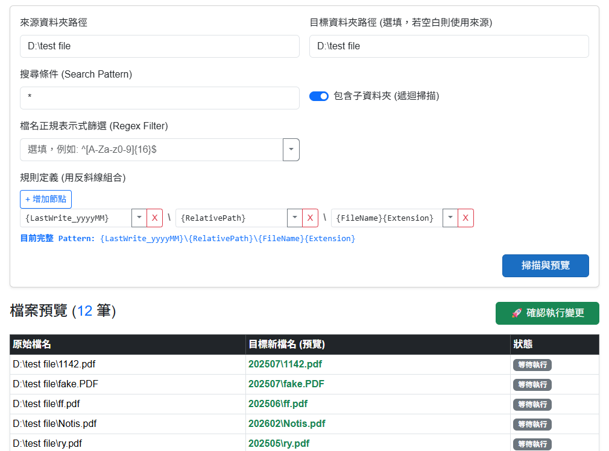

# FileRenameTool (批次檔案重新命名工具)

這是一個基於 .NET 10 與 Blazor 打造的單機版批次檔案重新命名與移動工具（以瀏覽器作為本機操作介面）。提供豐富的自訂規則，可利用 C# 片段（Snippet）動態設定檔名與路徑規劃，並在執行變更前提供完整的預覽功能。



## 核心功能

- 批次重新命名與移動
  - 可指定來源資料夾與目標資料夾。
  - 支援檔名搜尋條件（例如 `*.txt`）以及遞迴掃描包含子資料夾。
  - 支援正規表示式（Regex）對原始檔名進行進階篩選（例如 `^[0-9]+$`）。

- 動態檔名產生規則
  - 利用 Microsoft.CodeAnalysis.CSharp.Scripting 支援動態 C# 表達式。
  - 內建多種便捷變數組合，透過下拉選單快速新增節點：
    - `{RelativePath}`：相對路徑
    - `{FileName}`：原檔名
    - `{Extension}`：副檔名
    - `{Creation_yyyyMMdd}`：建立日期
    - `{Creation_yyyyMM}`：建立年月
    - `{LastWrite_yyyyMMdd}`：修改日期
    - `{LastWrite_yyyyMM}`：修改年月
    - `{FileName.Split('_')[0]}`：底線拆分取首段
    - `{FileName.Substring(0, 3)}`：取前三字元

- 設定檔管理
  - 可將目前的重新命名規則儲存為方案（Profile），方便未來重複讀取與使用。

- 效能優化
  - 預先編譯（Pre-compile）機制：透過預先將動態的 C# 腳本編譯，避免了在遍歷大量的檔案時重複執行高耗時的編譯動作。
  - 編譯快取機制：`RuleEngineService` 在處理每一筆檔案時，會利用 `RuleCacheService` 建立並重用編譯好的委派方法（Delegate），減少重複編譯。

- 預覽清單與狀態追蹤
  - 在實際執行檔案移動或重新命名之前，會先產生完整的結果列表。
  - 清楚標示成功或錯誤狀態，並可追蹤因衝突或錯誤所產生的訊息。

## 使用說明

1. 啟動應用程式後，進入首頁「批次檔案重新命名與移動」。
2. 設定來源資料夾路徑與目標資料夾路徑。
3. 根據需求設定搜尋條件與正規表示式篩選。
4. 點選「增加節點」組合新的檔名與路徑規則，可使用前述動態變數。
5. 點選「掃描與預覽」產生檔案變更列表。
6. 確認預覽清單無誤後，點選「確認執行變更」來實際處理檔案。

## 範例

### 依建立年月歸檔（本專案預設）
- 本專案預設提供的 Pattern 能將選擇的檔案依照檔案最後修改年月動態分類到子資料夾中
  - `{LastWrite_yyyyMM}`：會動態解析為檔案最後修改的西元年與月份（例如：`202310`），作為最外層分類資料夾。
  - `{RelativePath}`：保留從掃描來源取得的原始相對目錄結構。
  - `{FileName}{Extension}`：保留原本的檔名與副檔名。
```csharp
{LastWrite_yyyyMM}\{RelativePath}\{FileName}{Extension}
```

### FlattenFilesToRoot
- 先前的小工具 [FlattenFilesToRoot](https://github.com/CurtisChou-51/dev-toolkit-and-notes/tree/main/toolkits/C%23%20FlattenFilesToRoot) 可以將檔案攤平，本專案透過 Pattern 設定能達到相同效果：
```csharp
{System.IO.Path.Combine(RelativePath, FileName + Extension).Replace(@"\", "_")}
```
